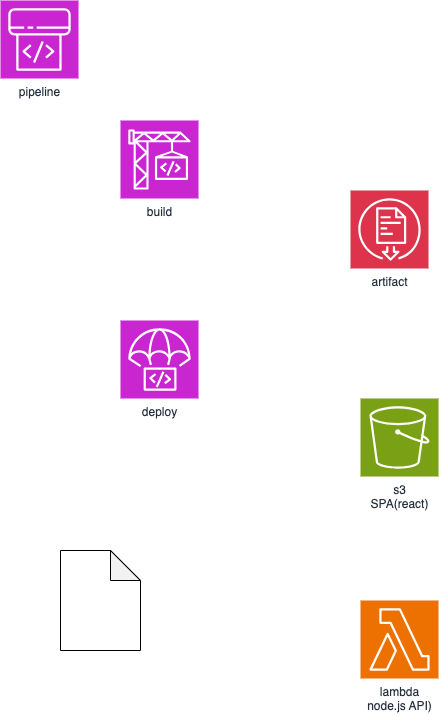

# aws-cicd-sample (CodePipeline, CodeBuild, CodeDeploy)

AWS の CICD についてのメモ



## 処理の流れ

```
CodePipeline
    -> CodeBuild -> Artifact(s3)
    -> CodeDeploy
```

## CodePipeline

## CodeBuild

## CodeDeploy
```

# aiへの問い合わせ

aws でCICDを実現したい

リポジトリはGithub
```
 tree -L 1
.
├── README.md
├── aws-code-pipeline.drawio.png
├── backend_lambda
└── front_spa_s3
```

front_spaはreact spa でs3にデプロイしたい
backendは lambda (node js)

code pipeline, code build, code deployの使い方をおしえて
```

## 主な手順

1. リポジトリの準備

1. IAMロールの作成

code pipeline, build, deploy が必要とする権限
aws iam create-role --role-name MyCodePipelineRole --assume-role-policy-document file://trust-policy-pipeline.json


aws iam attach-role-policy --role-name MyCodePipelineRole --policy-arn arn:aws:iam::aws:policy/AWSCodePipelineFullAccess
aws iam attach-role-policy --role-name MyCodePipelineRole --policy-arn arn:aws:iam::aws:policy/AmazonS3FullAccess

# 他に必要なポリシーがあれば追加


AWS_ACCOUNT_ID=049777008631
aws codepipeline create-pipeline --name My1stPipelineName --role-arn arn:aws:iam::$AWS_ACCOUNT_ID:role/CodePipelineRole --pipeline '{
    "name": "YourPipelineName",
    "roleArn": "arn:aws:iam::049777008631:role/MyCodePipelineRole",
    "stages": [
      # パイプラインのステージ定義
    ]
  }'


1. CodePipeline の作成

1. CodeBuild プロジェクトの作成

1. CodeDeploy アプリケーションとデプロイグループの作成

1. buildspec.yml の作成

1. デプロイ設定ファイルの作成 (appspec.yml)
